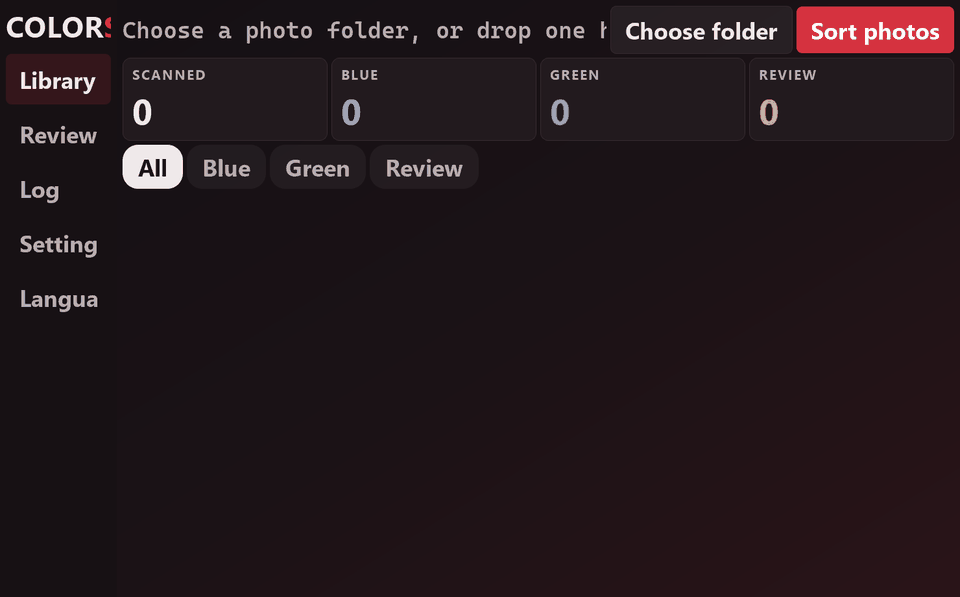
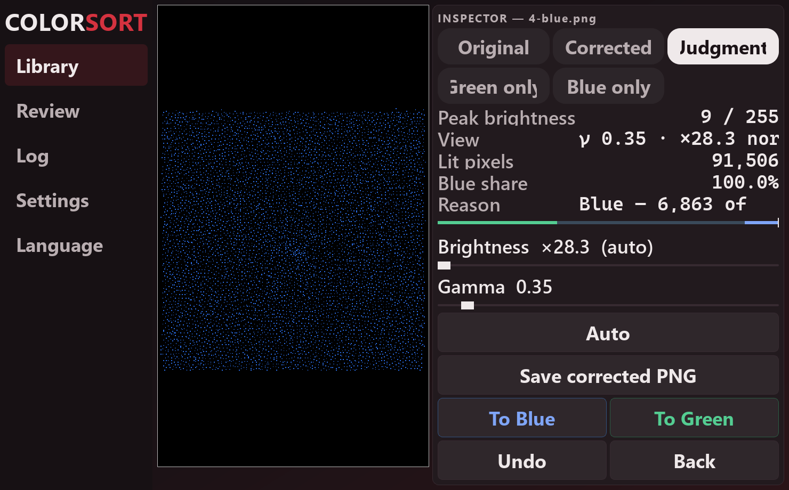
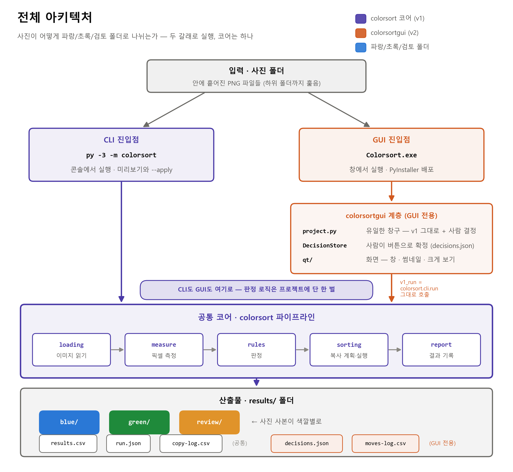
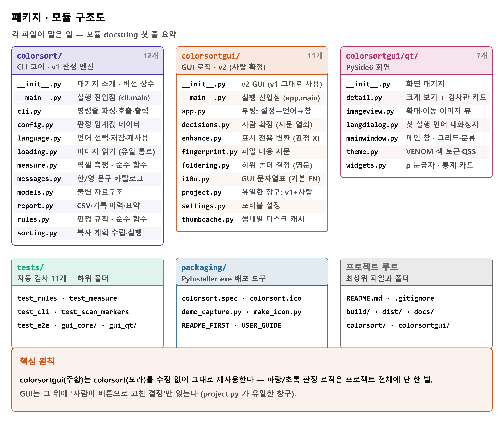
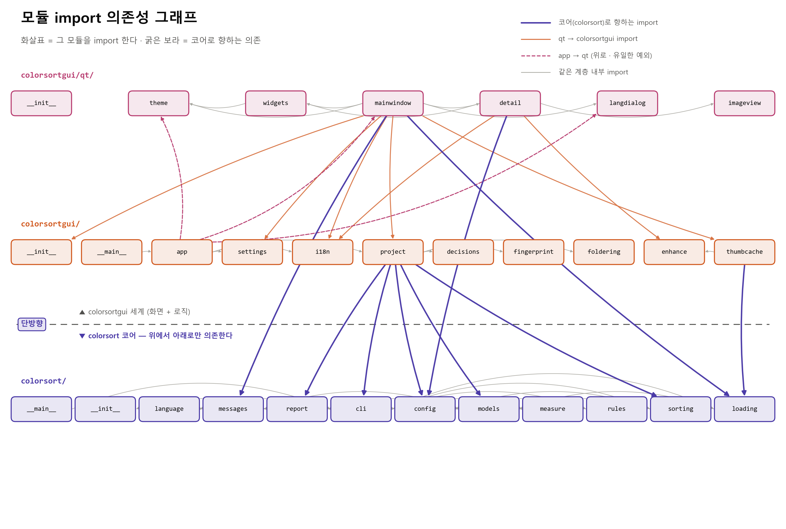
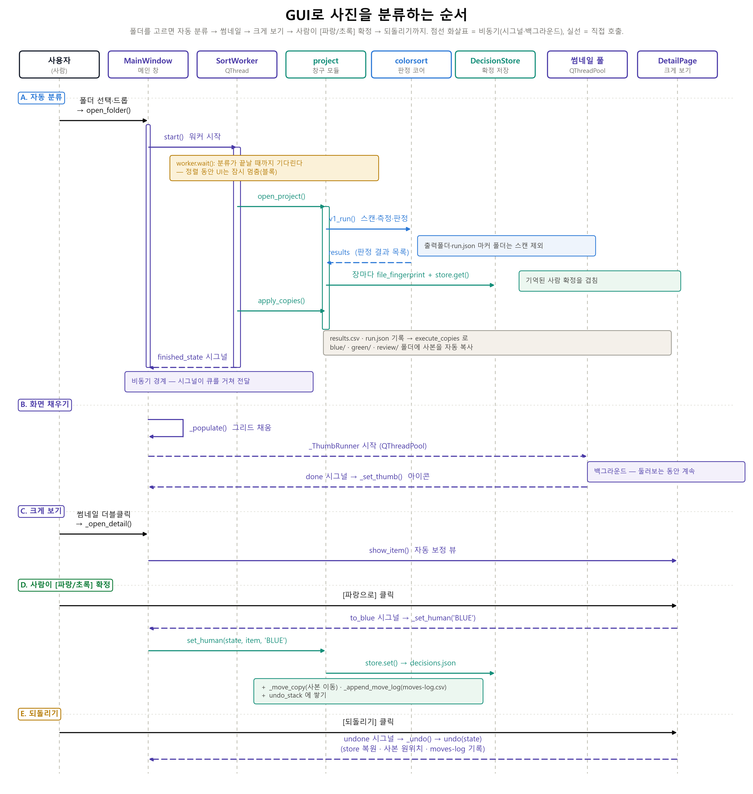
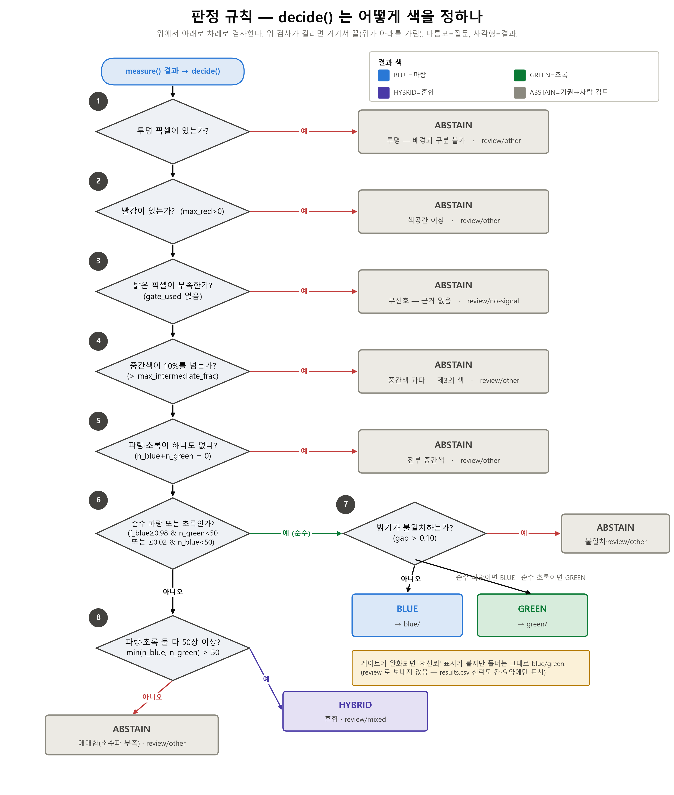
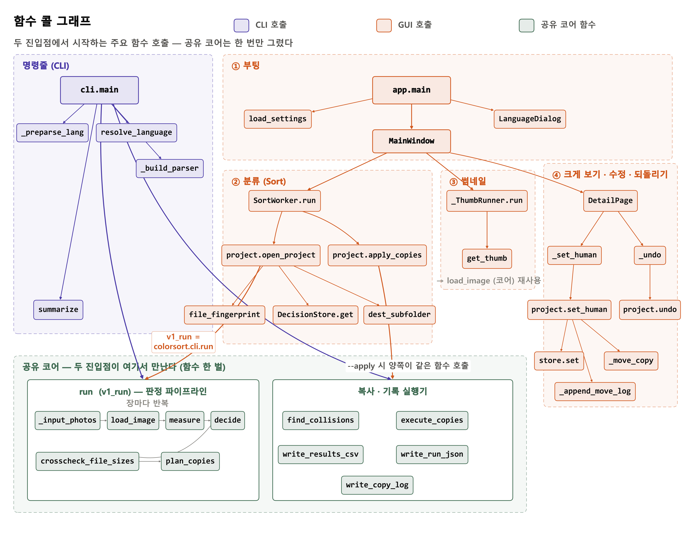
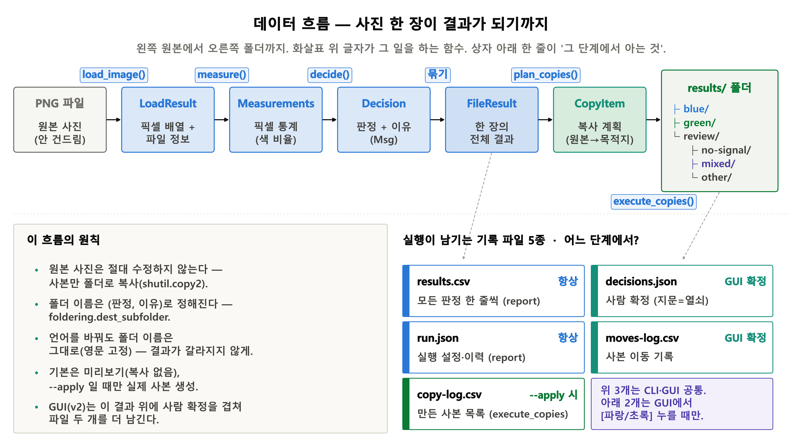

[English](README.md) | **한국어**

# Colorsort

사진의 **실제 픽셀 색**을 읽어 **파랑 / 초록**으로 자동 분류하는 Windows 프로그램입니다 파일 이름은 보지 않고, 오직 색만 봅니다.

사용 목적은 cell을 현미경으로 사진을 찍고 나서 구분 짓는것은 시간이 굉장히 오래 걸립니다. 이를 해결 하기 위해 만들어진 tool 중에 하나 입니다.
생물학의 빠른 발전을 도모하고자 개발 되었습니다.

EMT score에 따른 cell에 형광 강도가 뚜렷하고 강하게 나타나는 이미지를 찾을 수있습니다. 단, scroe 값은 측정하지 않고 파랑색, 초록색을 빠르게 구분 지어줍니다.

LNCAP picture에 lncap을 구분할수있고 PANC-1 picture 색을 빠르게 구분 가능하며 폴더로 정리 할수있습니다.

cell에 형광 강도가 뚜렷하고 강하게 나타나는 이미지를 찾을 수 있습니다.

<p align="center">
  <br>
  <em>폴더 하나만 고르면 끝: 검사 / 파랑 / 초록 / 확인 필요 — 이어서 확인과 확정까지. (예시 화면은 영어 UI이며, 한국어 UI도 지원합니다)</em>
</p>

[**📦 최신 버전 다운로드**](../../releases/latest) — `Colorsort-2.1.0.zip` 안에 실행 파일, 첫 실행 안내, 사용 설명서(영/한)가 함께 들어 있습니다.

## 무엇을 하는 프로그램인가요?

- 픽셀을 직접 읽어 사진을 **파랑**과 **초록**으로 나눕니다.
- 지원 형식: **PNG · JPG · JPEG · BMP · GIF · WEBP · TIFF** — 하위 폴더까지 모두 찾습니다.
- 판단이 애매한 사진은 `review`(확인 필요) 폴더로 분리해 사람에게 넘깁니다.
- **원본 사진은 절대 수정되지 않습니다.** 언제나 사본만 만듭니다.
- Windows 10/11이면 됩니다. 설치할 것도, 인터넷도 필요 없습니다.

## 사용 방법

> **⚠️ 중요: 사진을 한 장씩 클릭하는 것이 아닙니다.**
> **사진들이 모여 있는 "폴더"를 선택하면 프로그램이 알아서 작동합니다.**
> 폴더만 고르면 그 안(하위 폴더 포함)의 모든 사진을 자동으로 찾아 분류합니다.

1. zip 압축을 풀고 `Colorsort.exe`를 더블클릭합니다.
   - 처음 한 번 "Windows의 PC 보호" 파란 창이 뜨면 **"추가 정보" → "실행"** 을 누르세요.
   - 첫 실행은 몇 초 걸릴 수 있습니다. 정상입니다.
2. 언어를 고릅니다 (한국어 / English). 나중에 설정에서 바꿀 수 있습니다.
3. **"폴더 선택" 버튼을 눌러 사진 모음 폴더를 고르거나, 그 폴더를 창에 끌어다 놓으세요.**
   바로 분류가 시작됩니다.
4. 끝나면 카드에 숫자가 뜹니다: 검사 / 파랑 / 초록 / 확인 필요.
   결과는 고른 폴더 안 `results`에 **사본**으로 저장됩니다:

```
사진폴더\results\blue                파랑 사진 (사본)
사진폴더\results\green               초록 사진 (사본)
사진폴더\results\review\no-signal    거의 새까만 사진
사진폴더\results\review\mixed        파랑+초록이 함께 있는 사진
사진폴더\results\review\other        그 밖의 애매한 사진
사진폴더\results\results.csv         모든 판정과 그 이유 (엑셀에서 열림)
```

## 애매한 사진은 직접 확정

<p align="center">
  <br>
  <em>검사관: 자동 보정된 화면, 픽셀 값 표시, 그리고 판정의 정확한 이유.</em>
</p>

- 썸네일을 **더블클릭**하면 크게 열립니다. 어두운 사진도 자동 보정되어 형태가 보입니다.
- "판정 색칠" 보기는 프로그램이 어느 픽셀을 파랑/초록으로 셌는지 그대로 색칠해 보여줍니다.
- **[파랑으로] / [초록으로]** 버튼으로 확정하면 사본이 그 폴더로 이동하고, **되돌리기**로 취소할 수 있습니다.
- 확정은 사진 내용의 **지문**으로 기억됩니다 — 다시 분류해도, 파일 이름을 바꿔도, USB를 다른 컴퓨터에 꽂아도 유지됩니다.

## 원본은 안전합니다

이 프로그램은 사진을 **복사만** 합니다. 옮기거나, 지우거나, 이름을 바꾸지 않습니다.
같은 폴더(또는 상위 폴더)를 다시 분류해도 이전 결과 폴더를 알아보고 건너뛰므로 사본이 이중으로 세어지지 않습니다.

## 어떻게 만들었나

이 프로젝트는 **판정 로직 한 벌**을 공유하는 두 개의 파이썬 패키지입니다:

- **`colorsort`** — 핵심부: 폴더를 스캔하고, 픽셀을 측정하고, 파랑/초록 규칙을 적용하고, 파일을 복사하고, `results.csv`와 `run.json`을 기록합니다. 그대로 CLI로도 쓸 수 있습니다.
- **`colorsortgui`** — 핵심부를 **수정 없이 그대로 재사용**하는 PySide6 데스크톱 앱. 썸네일, 검사관, 그리고 사람의 확정("이 판정은 사람이 고쳤다"의 유일한 창구인 `project.py`)을 얹습니다.

아래 그림은 전부 [`docs/diagrams/generate`](docs/diagrams/generate)의 스크립트가 코드에서 생성한 것입니다. 영어판 다이어그램은 [`docs/diagrams`](docs/diagrams)에 함께 있습니다.

### 전체 구조

<p align="center">
  <br>
  <em>GUI와 CLI는 같은 핵심부 위의 얇은 껍데기 — 파랑/초록 로직은 프로젝트 전체에 딱 한 벌.</em>
</p>

### 저장소 구성

<p align="center">
  <br>
  <em>무엇이 어디에 있는지: 핵심 패키지, GUI 패키지, 테스트, 패키징 도구.</em>
</p>

### 모듈 의존 관계

<p align="center">
  <br>
  <em>의존은 한 방향뿐: GUI → 핵심부. 핵심부는 GUI를 모릅니다.</em>
</p>

### 주요 클래스

<p align="center">
  <br>
  <em>핵심 클래스들과 그 관계.</em>
</p>

### 폴더를 고르면 벌어지는 일 (GUI)

<p align="center">
  <br>
  <em>폴더 선택 → 스캔 → 판정 → 복사 → 썸네일, 단계별 흐름.</em>
</p>

### 같은 흐름의 명령줄 버전

<p align="center">
  <br>
  <em>CLI도 동일한 파이프라인 — 미리보기(기본)와 --apply(실제 복사) 두 모드.</em>
</p>

### 파랑 / 초록을 정하는 규칙

<p align="center">
  <br>
  <em>사진 한 장마다 거치는 판정 경로 — 그리고 언제 판단을 포기하고 사람에게 넘기는지(review).</em>
</p>

### 호출 그래프

<p align="center">
  <br>
  <em>두 패키지에 걸쳐 어떤 함수가 어떤 함수를 부르는지.</em>
</p>

### 데이터 흐름

<p align="center">
  <br>
  <em>원본은 읽기 전용 — 프로그램이 만드는 모든 것은 results/ 안에 사본과 기록으로만 생깁니다.</em>
</p>

## 명령줄(CLI) 버전 — 파이썬 사용자용

GUI와 같은 판정 로직을 쓰는 CLI도 들어 있습니다. 파이썬 3.10 이상이 필요합니다.

```
py -3 -m pip install pillow numpy          # 처음 한 번만
py -3 -m colorsort 사진폴더 --output results          # 미리보기 (사진은 건드리지 않음)
py -3 -m colorsort 사진폴더 --output results --apply  # 실제 복사
```

`--apply`를 붙였을 때만 사본을 만듭니다. `--lang en`으로 영어 출력, `--lang-reset`으로 언어 선택을 초기화합니다.

## 개발자 안내

```
py -3 -m pytest                                      # 테스트 실행
py -3.12 packaging\make_icon.py                      # 아이콘 생성
py -3.12 -m PyInstaller packaging\colorsort.spec --noconfirm   # exe 빌드 → dist\Colorsort.exe
```

다이어그램 18장(9종 × 영/한)을 코드에서 다시 생성하려면:

```
python3 docs/diagrams/generate/build_all.py
```

## Authors

- Kyung-Bo Kim
