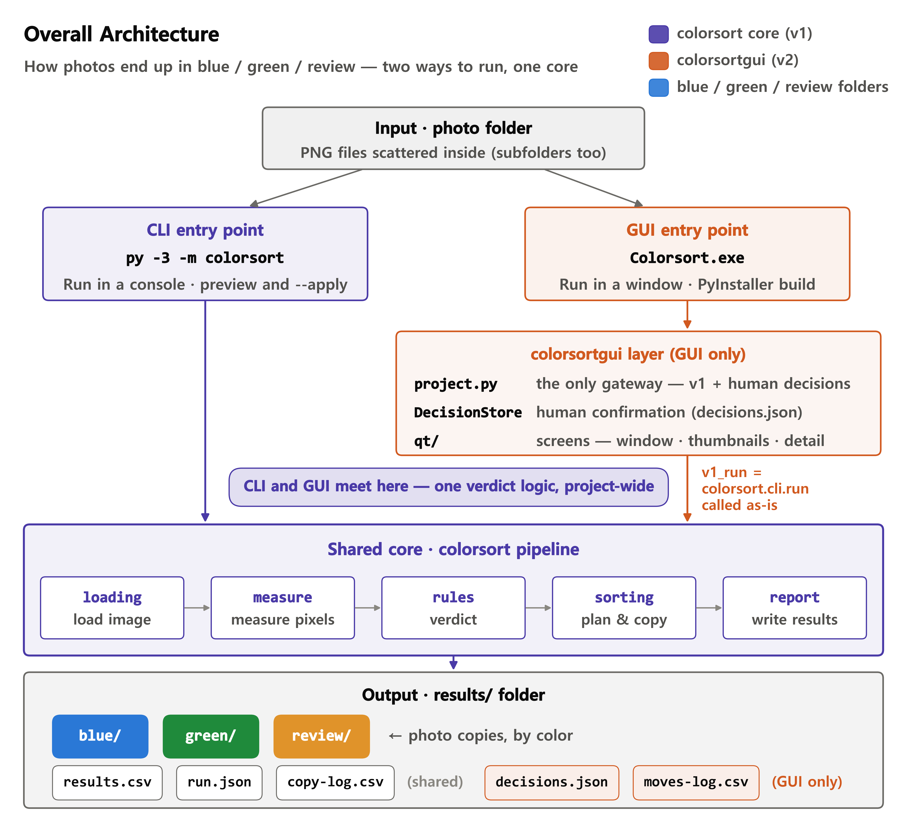
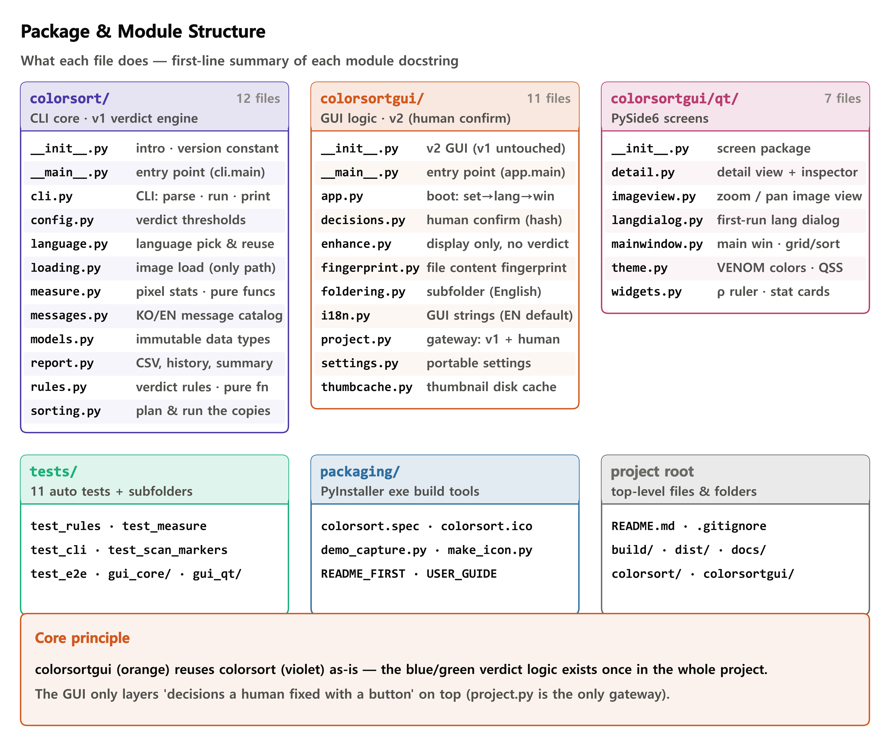
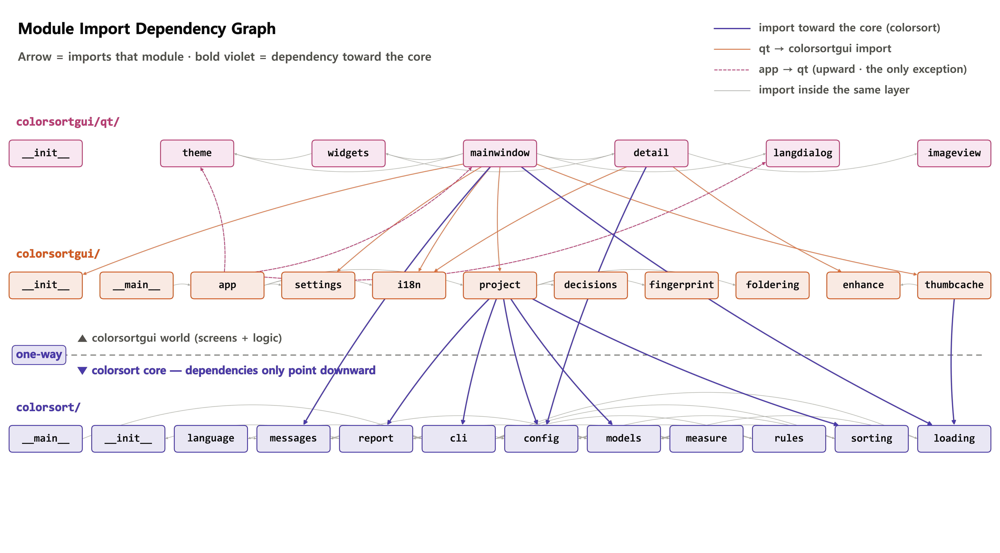
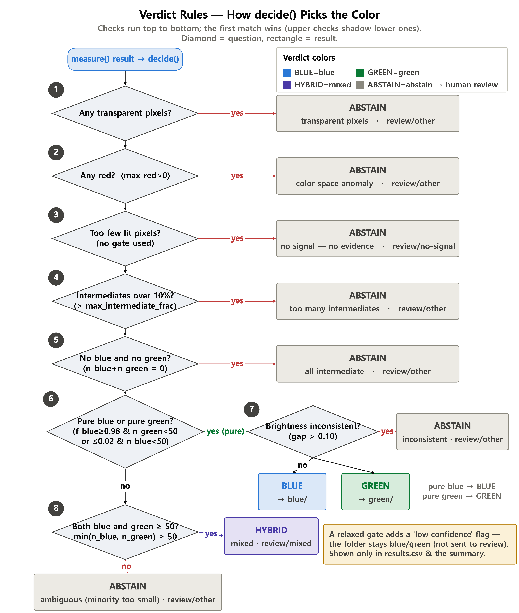
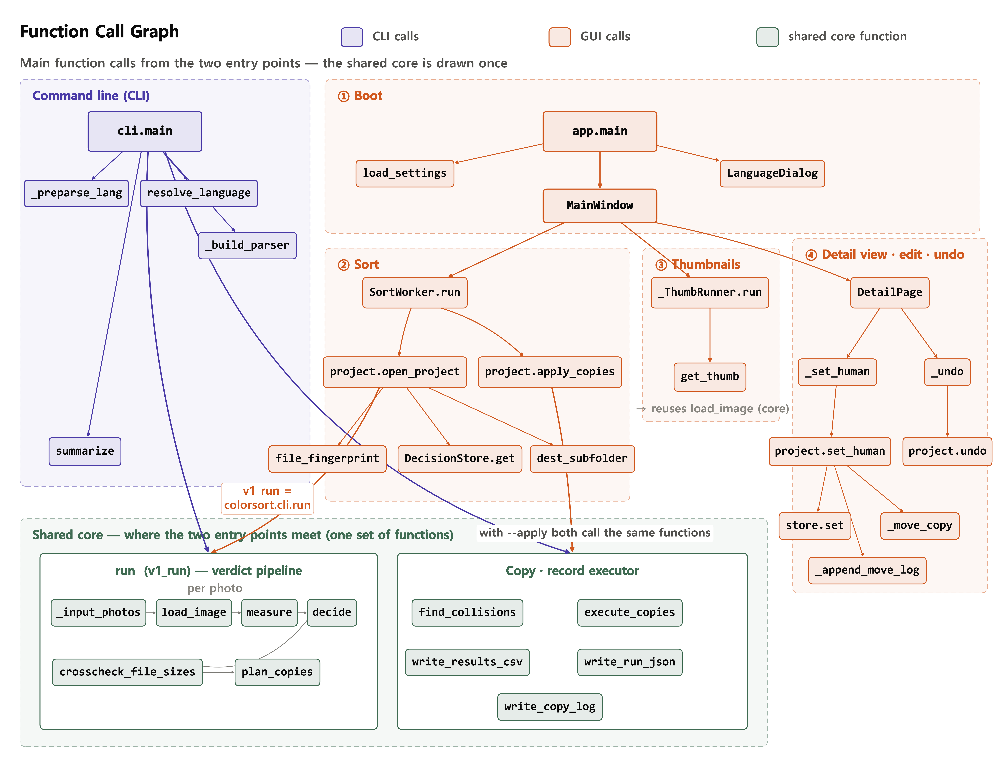
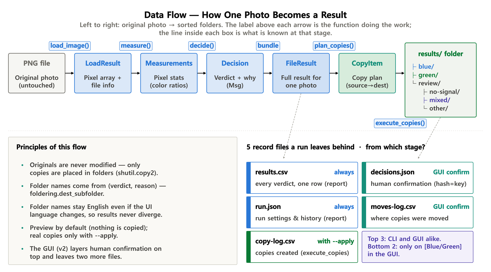

**English** | [한국어](README.ko.md)

# Colorsort

A Windows app that sorts photos into **Blue / Green** by reading their **actual pixel colors** — file names are ignored, only the colors count.

<p align="center">
  <br>
  <em>One folder in, everything sorted: Scanned / Blue / Green / Review.</em>
</p>

[**📦 Download the latest release**](../../releases/latest) — `Colorsort-2.1.0.zip` contains the executable, a first-run note, and the user guide (EN/KO).

## What it does

- Sorts photos into **blue** and **green** by reading the pixels directly.
- Reads **PNG · JPG · JPEG · BMP · GIF · WEBP · TIFF**, subfolders included.
- Photos it cannot judge go to a `review` folder for your eyes.
- **Your original photos are NEVER modified.** The app only makes copies.
- Windows 10 or 11. Nothing to install, no internet needed.

## How to use

> **⚠️ Important: you do NOT click photos one by one.**
> **Select the folder that contains your photos, and the program does the rest.**
> Pick one folder and every photo inside it (subfolders included) is found and sorted automatically.

1. Unzip and double-click `Colorsort.exe`.
   - If Windows shows "Windows protected your PC" the first time, click **"More info" → "Run anyway"**.
   - The first launch can take a few seconds. This is normal.
2. Pick your language (English / 한국어). You can change it later in Settings.
3. **Click "Choose folder" and select the folder your photos are in — or drag that folder onto the window.**
   Sorting starts right away.
4. When done, the cards show the counts: Scanned / Blue / Green / Review.
   Results are saved as **copies** inside your photo folder, under `results`:

```
your-folder\results\blue                blue photos (copies)
your-folder\results\green               green photos (copies)
your-folder\results\review\no-signal    nearly black photos
your-folder\results\review\mixed        blue + green in one photo
your-folder\results\review\other        anything else unclear
your-folder\results\results.csv         every judgment, with the reason (opens in Excel)
```

## Deciding the unclear ones yourself

<p align="center">
  <br>
  <em>The inspector: auto-brightened view, per-pixel readout, and the exact reason for the judgment.</em>
</p>

- **Double-click** any thumbnail to open it big — dark photos open already brightened.
- The "Judgment" view paints exactly which pixels were counted as blue / green.
- **[To Blue] / [To Green]** moves that photo's copy to the chosen folder; **Undo** reverses it.
- Decisions are remembered by the photo's **content fingerprint** — they survive re-sorting, file renames, and moving the USB drive to another computer.

## Your originals are safe

The app only **copies** photos. It never moves, deletes, or renames your files.
Re-sorting the same folder (or a parent folder) never counts the copies twice — previous result folders are recognized and skipped.

## How it's built

The project is two Python packages sharing **one** judgment engine:

- **`colorsort`** — the core: scans folders, measures pixels, applies the blue/green rules, copies files, and writes `results.csv` + `run.json`. Also usable directly as a CLI.
- **`colorsortgui`** — a PySide6 desktop app layered **on top of the unchanged core**. It adds thumbnails, the inspector, and human corrections (`project.py` is the single gateway for "a person overrode this judgment").

Everything below is generated from the code by the scripts in [`docs/diagrams/generate`](docs/diagrams/generate). Korean versions of all diagrams are in [`docs/diagrams`](docs/diagrams).

### Architecture

<p align="center">
  <br>
  <em>GUI and CLI are two thin fronts over the same core — the blue/green logic exists exactly once.</em>
</p>

### Repository layout

<p align="center">
  <br>
  <em>What lives where: core package, GUI package, tests, packaging tools.</em>
</p>

### Module dependencies

<p align="center">
  <br>
  <em>Dependencies point one way only: GUI → core. The core never imports the GUI.</em>
</p>

### Main classes

<p align="center">
  <br>
  <em>The key classes and how they relate.</em>
</p>

### What happens when you pick a folder (GUI)

<p align="center">
  <br>
  <em>Folder in → scan → judge → copy → thumbnails, step by step.</em>
</p>

### The same flow on the command line

<p align="center">
  <br>
  <em>The CLI runs the identical pipeline, with preview (default) and --apply (copy) modes.</em>
</p>

### How blue / green is decided

<p align="center">
  <br>
  <em>The decision path for every photo — and when it gives up and asks a human (review).</em>
</p>

### Call graph

<p align="center">
  <br>
  <em>Which function calls which, across both packages.</em>
</p>

### Data flow

<p align="center">
  <br>
  <em>Originals are read-only; everything the app produces lands in results/ as copies and records.</em>
</p>

## Command-line (CLI) version — for Python users

The same judgment logic is available as a CLI. Requires Python 3.10+.

```
py -3 -m pip install pillow numpy          # once
py -3 -m colorsort your-folder --output results          # preview (touches nothing)
py -3 -m colorsort your-folder --output results --apply  # actually copy
```

Copies are made only with `--apply`. Use `--lang en` for English output, `--lang-reset` to reset the language choice.

## For developers

```
py -3 -m pytest                                      # run the test suite
py -3.12 packaging\make_icon.py                      # generate the icon
py -3.12 -m PyInstaller packaging\colorsort.spec --noconfirm   # build → dist\Colorsort.exe
```

To regenerate all 18 diagrams (9 kinds × EN/KO) from the code:

```
python3 docs/diagrams/generate/build_all.py
```
